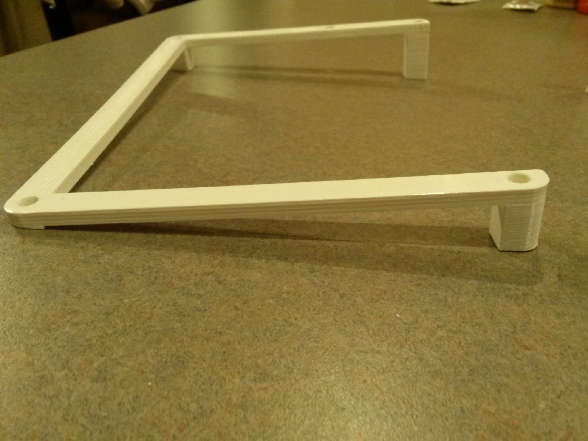
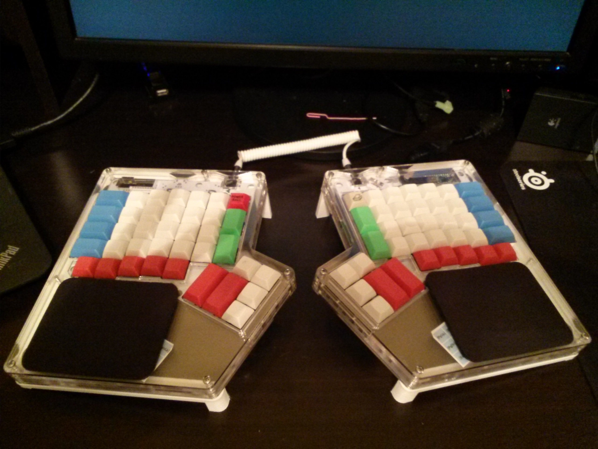
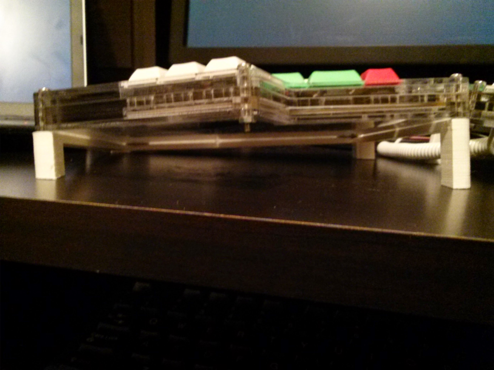

A forked ergodox-tent with tilting and much more

# 11 Sep 2014: Prints received!

I received my printed fullhand stands at 6 degrees tent and 3.5 degrees tilt. Here are the photos!

Can you see what I forgot? The middle left nut hole :( Therefore I had to remove that screw from each hand. I have since corrected the code and sample STL/SCAD files.

The standard-size test print from Shapeways is in the mail now.

## The design

I (bchociej) forked this repo from [adereth/ergodox-tent](https://github.com/adereth/ergodox-tent) and implemented new features, including tilting, native millimeter dimensions, and full-hand version. I have also cleaned up and parameterized the code a bit.

*Note carefully:* my version is slightly different than adereth's in that mine is designed to span the entire width of the Ergodox keyboard. Adereth's version did some trig to figure out exactly how high to make the half-width model. In mine, you are free to adjust the height as you wish so long as the printed stand spans the entire width. I recommend keeping at least 5mm extra material at the lowest point of the stand in order to house screws and nuts that poke through. Your keyboard may vary, so take measurements and use common sense when tweaking the customizable parameters in [core.clj](src/ergodox_stand/core.clj).

## Customization
Edit the "CUSTOMIZABLES" section of [core.clj](src/ergodox_stand/core.clj) to tweak the output. You can customize standard/full-hand design, tent angle, tilt angle, height adjustment, and the gap between the two sides for printing.

## Building etc.
I didn't know what I was doing when I cloned this repo. Maybe you don't either! Here's how I got things working:

1.	Install leiningen (a shell script) into the $PATH from here: [lein](https://raw.githubusercontent.com/technomancy/leiningen/stable/bin/lein)
2.	Install openscad from OS package manager
3.	Start lein from the root directory of this repo using `$ lein repl`
4.	Make some changes to [core.clj](src/ergodox_stand/core.clj)
5.	In the lein REPL (at the `user=> ` prompt), enter `(use 'ergodox-stand.core :reload)`
6.	Open [stand.scad](resources/stand.scad) in openscad
7.	Repeat steps 4-6

You can use openscad to Build (F6) and Export to .stl format too.

To fulfill the various licenses: this is based on work by [adereth](https://github.com/adereth/), and I have modified it as described above. I hereby release modifications under the same licensing conditions as the original work.

# ergodox-tent
**(this section based on Adereth's original README.md)**

A tent for the [Ergodox acrylic case designed by Litster](http://deskthority.net/wiki/ErgoDox).  The design was implemented using [clj-scad](https://github.com/farrellm/scad-clj).

Adereth's original version, off of which this fork is based:

## Usage

If you're just interested in printing your own, just download [resources/stand.stl](resources/stand.stl) and feed it into your favorite software for 3D printing.

If you'd like to contribute, I'd prefer you make changes to the original Clojure source.  I've also included the [generated SCAD](resources/stand.scad) if you want to experiment and don't have a Clojure environment set up.

## License

All source is distributed under the Eclipse Public License either version 1.0 or (at
your option) any later version.

The stand design and all images are released under the [Creative Commons Attribution-ShareAlike 4.0 International License (CC BY-SA 4.0)](http://creativecommons.org/licenses/by-sa/4.0/)
